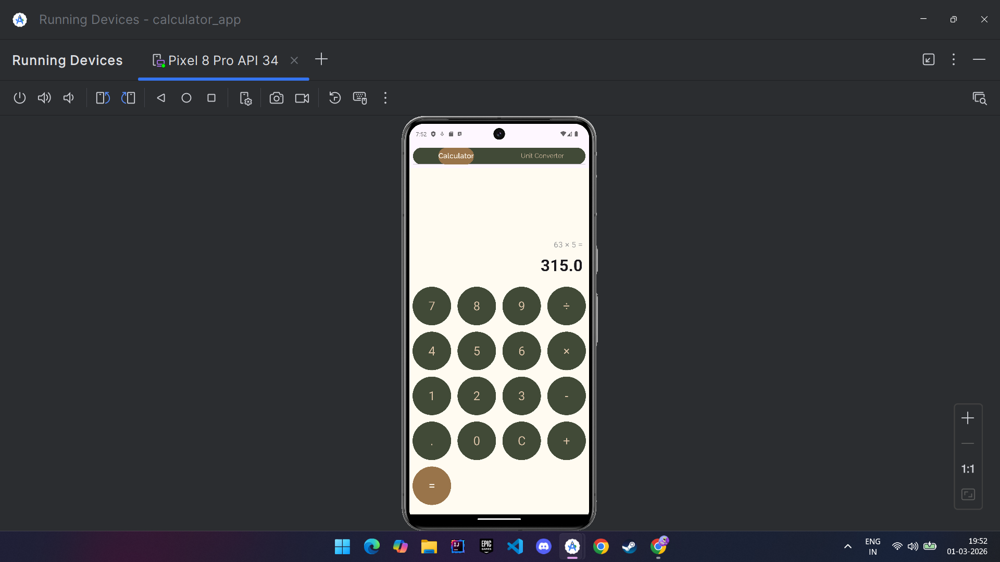
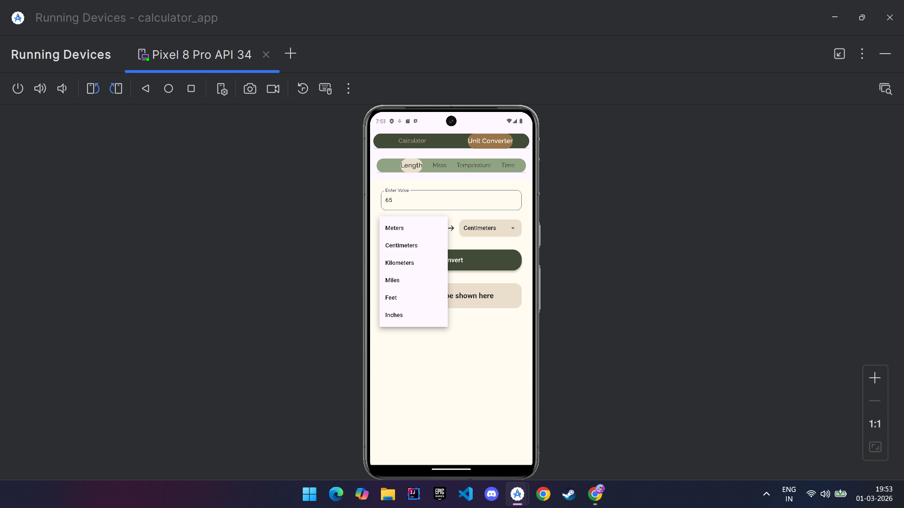
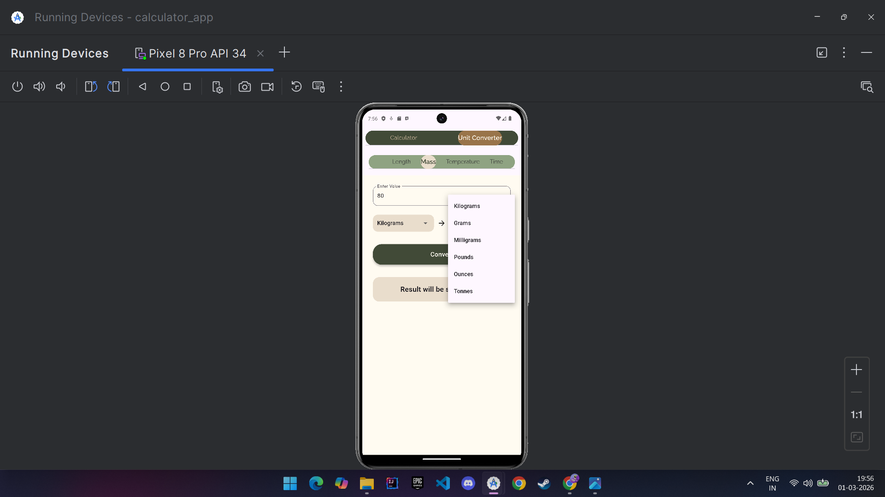
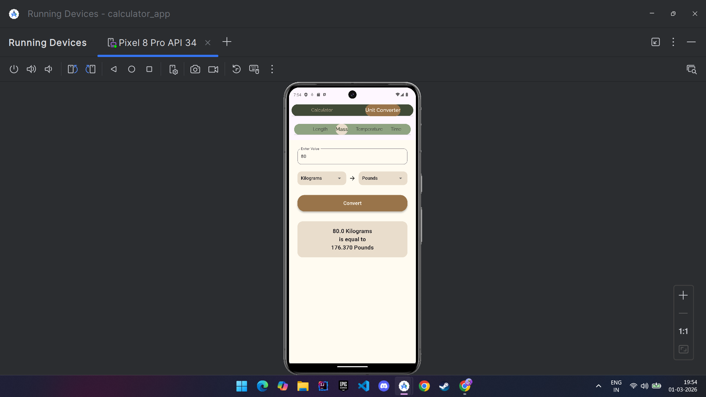
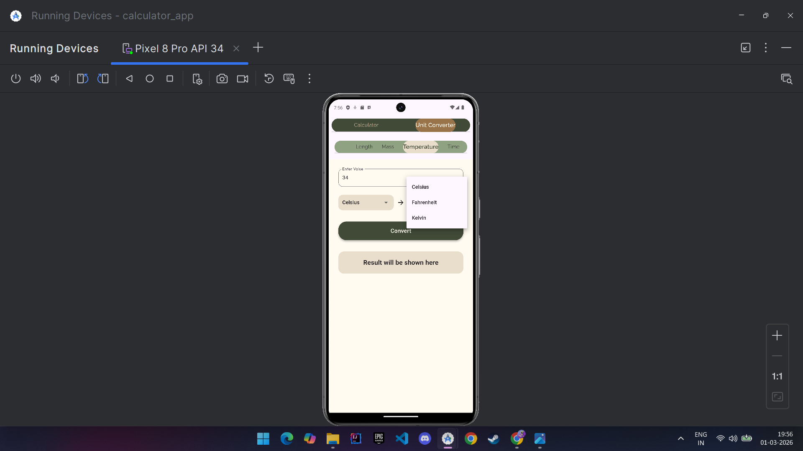
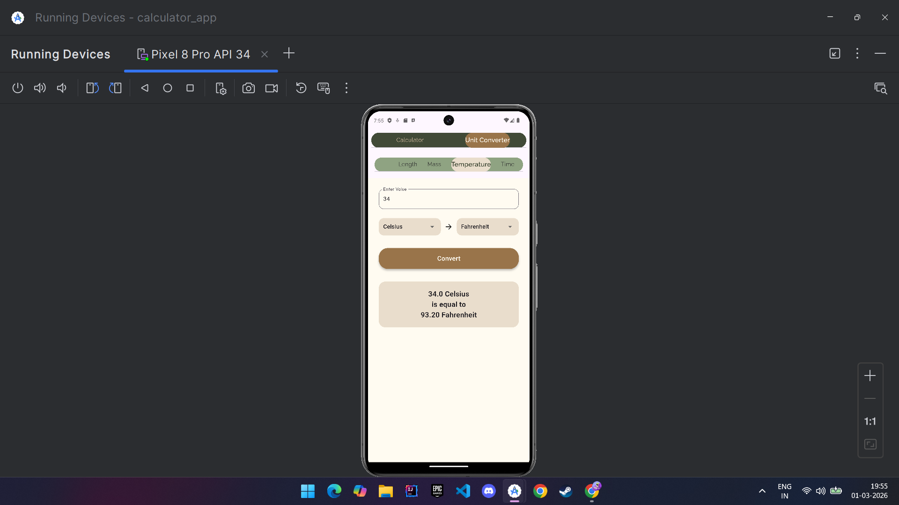
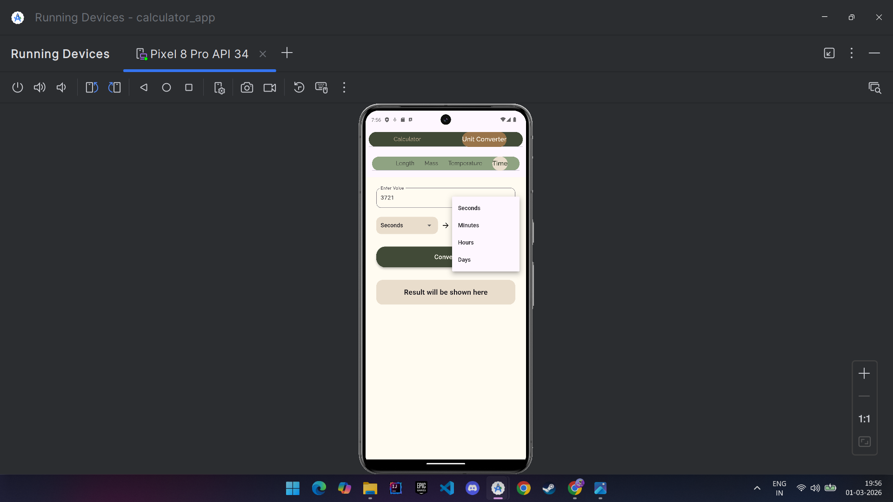
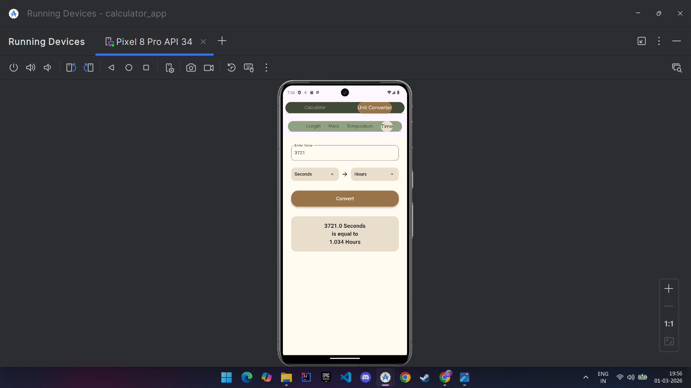
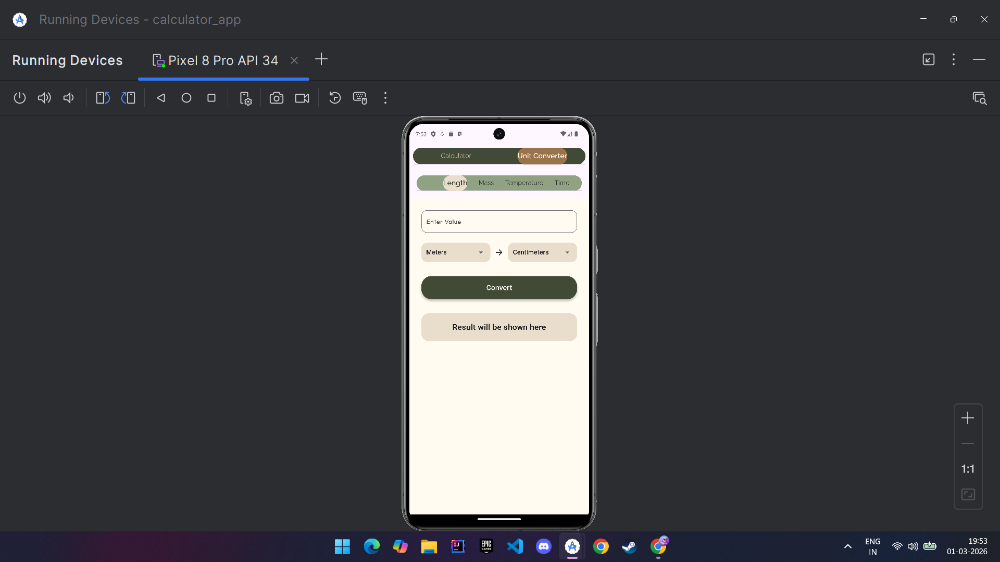

# CalciConvert 📱

CalciConvert is a Flutter-based Calculator & Unit Converter app with a custom themed UI and multiple conversion categories.

---

## ✨ Features

- 🧮 Basic arithmetic calculator
- 📏 Length conversion
- ⚖️ Mass conversion
- 🌡 Temperature conversion
- ⏱ Time conversion
- 🎨 Custom consistent color theme
- 📱 Responsive layout handling
- ⌨️ Keyboard dismissal handling
- 🔁 Tab-based navigation

---

## 🛠 Tech Stack

- Flutter
- Dart
- Stateful Widgets
- GridView
- Custom Theming
- Git & GitHub

---

## 🚀 What I Learned

- Managing layout overflow issues in Flutter
- Handling keyboard behavior using FocusScope
- Structuring multi-tab applications using DefaultTabController
- Maintaining consistent UI themes across screens
- Real-world Git workflow and version control

---

## 📦 Project Structure

lib/
├── screens/
│    ├── unit_convertor_tabs/
│    │     ├── length_tab.dart
│    │     ├── mass_tab.dart
│    │     ├── temperature_tab.dart
│    │     └── time_tab.dart
│    ├── calculator_screen.dart
│    ├── home_screen.dart
│    └── unit_converter_screen.dart
├── colors.dart
└── main.dart

## 📸 Screenshots

### 🧮 Calculator

---

### 📏 Length Converter

---

### ⚖️ Mass Converter

---

### 🌡 Temperature Converter

---

### ⏱ Time Converter

---

### 🔁 Unit Converter Tab

---

## 👨‍💻 Author

**Abhishek Singh**  
Flutter Developer (Entry-Level)

---

If you found this project helpful, feel free to star the repo ⭐

